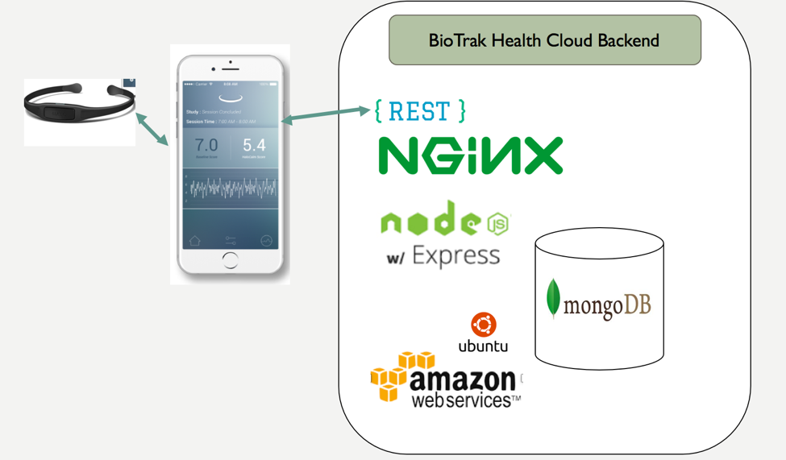
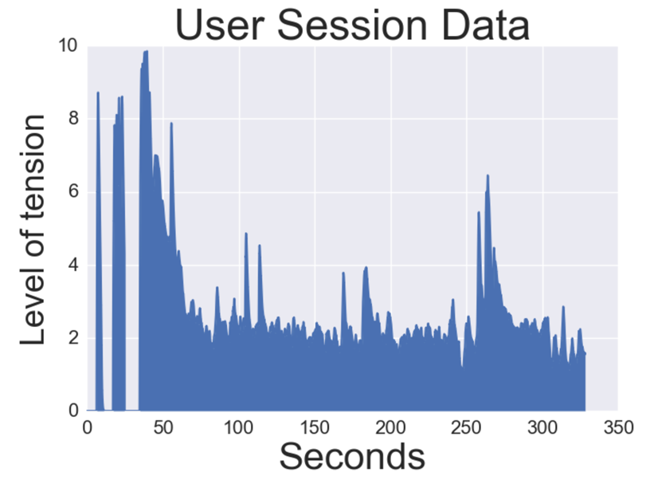
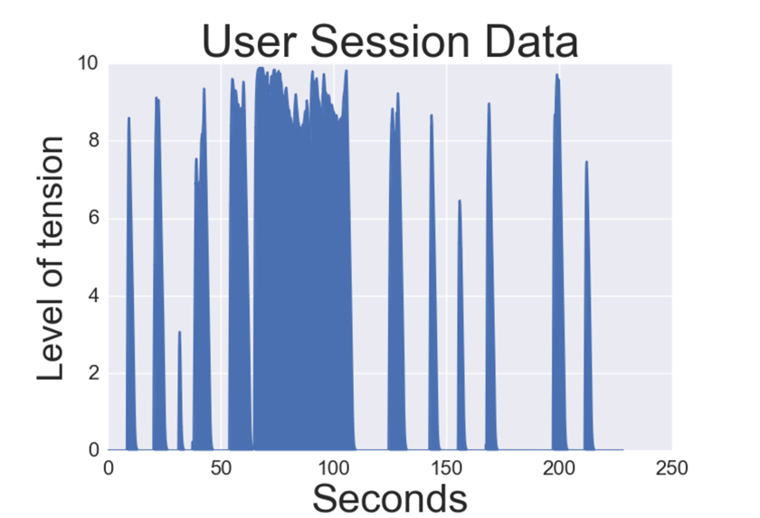
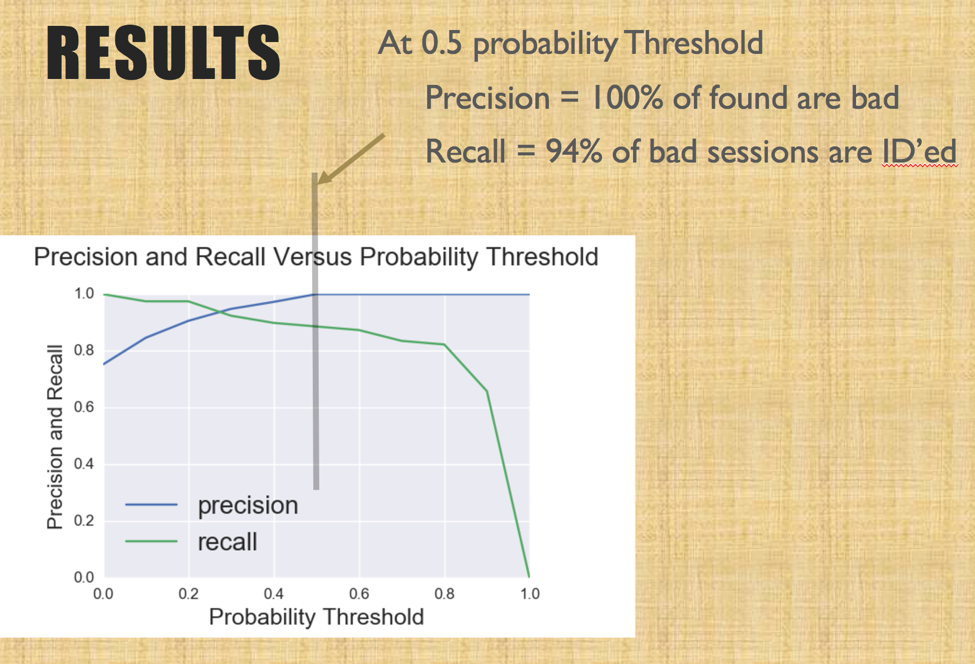
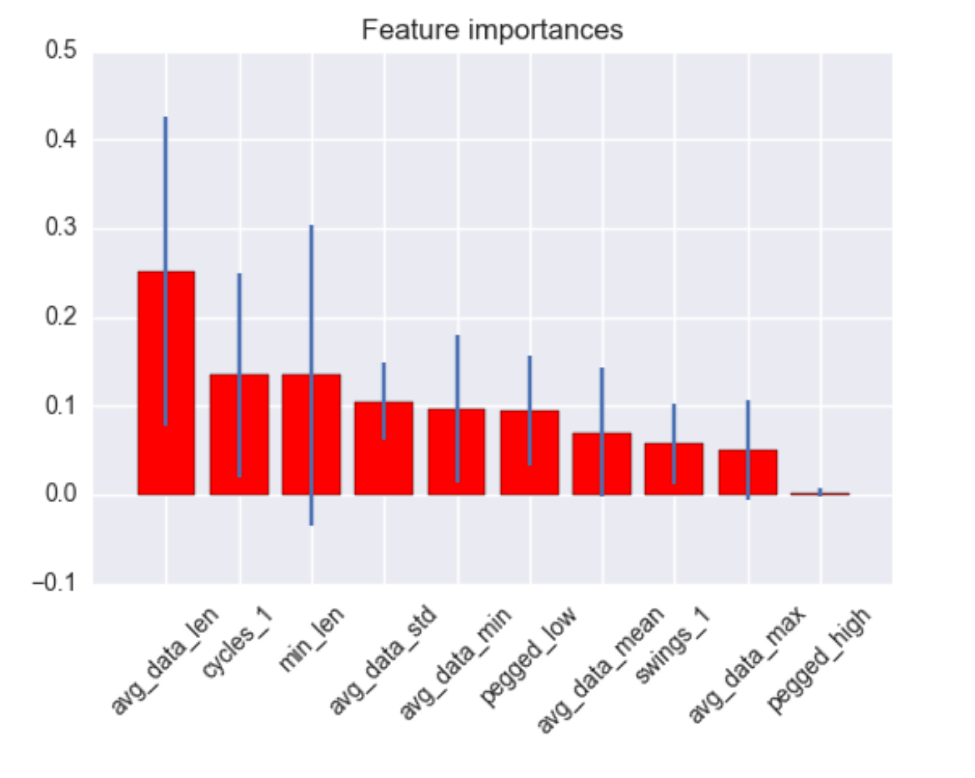
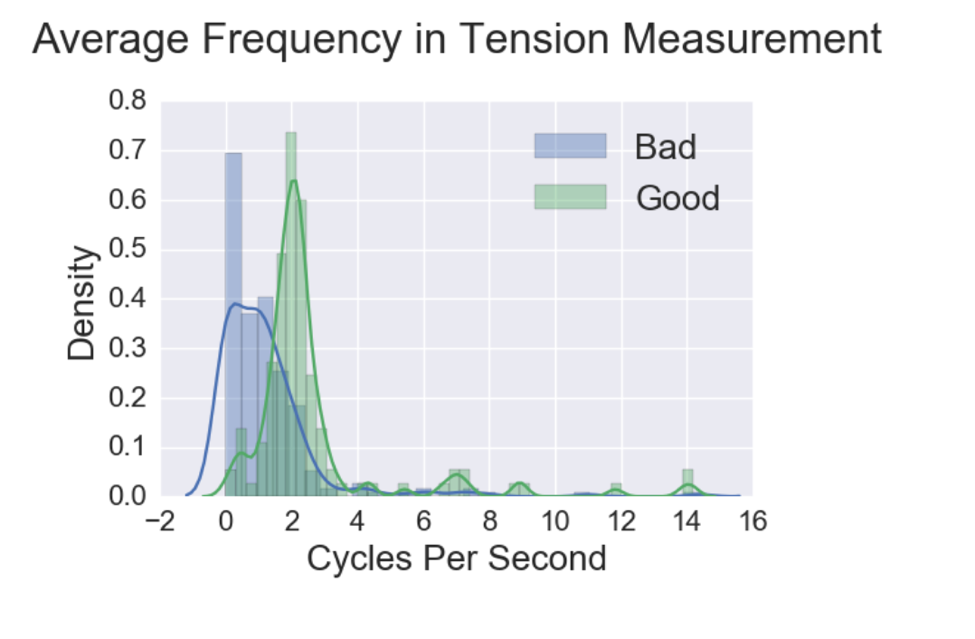
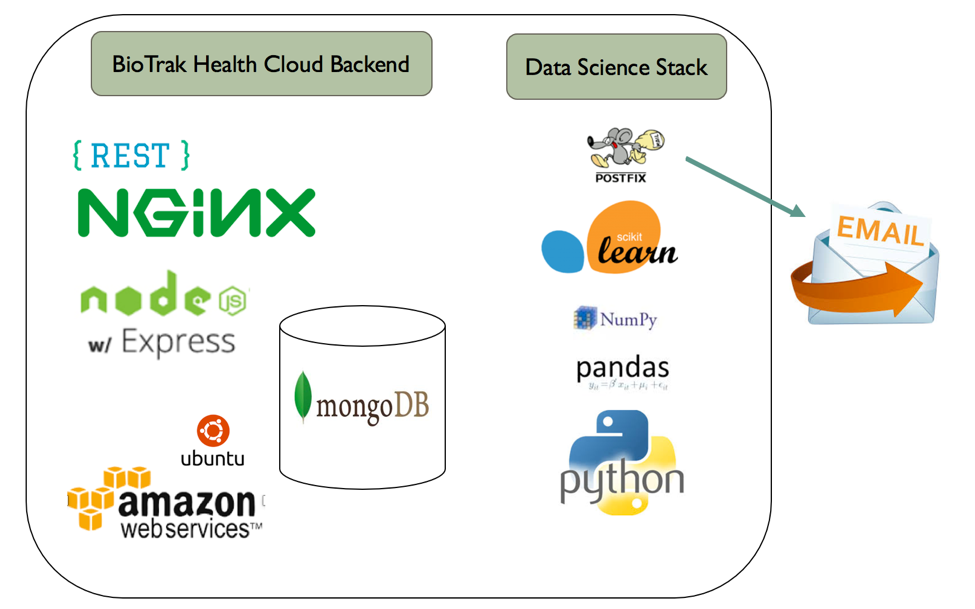

# Stress_Management
Data Science: Build and deploy a classifier to label uploaded sessions as bad or good

# Brian McKean

## Overview

[Biotrak Health](https://www.biotrakhealth.com "BioTrak Health Homepage") is a company making a headband and app that can be used to manage stress via biofeedback. BioTrak is in the early stages of developing its technology. The first headbands have been developed and are being tested in a trial with friends and family of the the company members. The purpose of the classifier is to classify each session as an effective use or not effective use of the system.

Once these sessions have been classified we can begin to look for patterns and root causes.

With root causes we can start to look for ways to eliminated problems and improve the product.

## Introduction

The system architecture currently includes a custom headband with BioTrak Health developed hardware and software, an iOS app, and a cloud back end with a REST API for use by the app.  

### Headband
The biofeedback device is a headband. The headband has sensors that detect electrical activity in forehead muscles. There is always activity present but actions like talking or chewing cause nearby muscles to be activated and this activity is detected by the headband.

### App
When the user stops activity and tries to relax, the base tension level of the forehead muscles is detected. Throughout the process the activity level is communicated to a mobile app. The mobile app provides three functions:
1. Display of tension level to the user
2. A variety of coaching sessions to help with tension reduction
3. Communication with the cloud REST api to store and retrieve data, including upload of session data at the conclusion of the session.

### Cloud Back End
The cloud back end is built on AWS with a Node/Express/MongoDB stack running on Ubuntu. The app uploads each session into the mongoDB session collection via a REST interface. When I started working with Biotrak Health they did not have the cloud backend implemented. So I architected and implemented the REST based cloud storage using the stack shown.

##  Project Goal

The project goal is to develop a machine learning model to classify each uploaded session as either an 'effective' or 'not_effective' use of the product. Since the goal is to find bad sessions the model will use a binary classifier with True='bad session' and False='Good Session'

### Session information
Each session uploaded includes a record of the data sent from the headband to the app in addition to metadata generated by the app. The app generated metadata includes user information, date and time, and session metadata such as which type of session.

This project uses the session data generated by the headband for classifying the session.  Figure 1 shows a good session. In the session shown the user initially has difficulty getting a proper signal from the headband contacts but then the signal is good and remains good through the remainder of the session.

A bad session, shown in Figure 2,  can be bad for a variety of reasons. In this case the user had problem throughout the session getting a proper measurement of tension in the forehead.

### Development of Features

The analysis needs to examine the time series data uploaded to determine if a session was good or bad.
Referring back to Figure 1, the data that we have to work with is a time series. Unlike a typical time series analysis, the goal is not to predict the future. Therefore we need to look at how to distinguish between the good and bad sessions.

I started with some basic mathematical analysis of the data:
1. Max
2. Min
3. Mean
4. Standard Deviation

Then I added some other metrics that I thought may be significant
5. Length of session
6. Average cycles per second during session
7. Max change from point to point in the series

The I worked with a BioTrak firmware engineer to develop some Hueristics for classification of good sessions:
8. Must last at least 60 seconds
9. No 0 readings after 60 seconds
10. No 10 readings after 60 seconds
A 0 or 10 reading indicates signal loss

### Development of Training Data

I worked with a Biotrak engineer to classify sessions. We worked through the 356 sessions.  
The classification ended up being:
* Good: 119 sessions
* Bad: 237 sessions

There were a high percentage of bad sessions in the data. This was due to the fact that most sessions were from the engineering team. The engineering team tended to use bad sessions to test software and hardware.

### Model Exploration
My approach was to develop and analyze the project with Random Forest. Take that through to make predictions. Then come back and test other models. A pdf of the jupyter notebook I used for exploration is [here](./notebooks/Brian_McKean_Stress_Management.pdf).  The models I explored are listed below along with their accuracies:
* Random Forest: 0.89
* Adaboost: 0.86
* Gradient Boosting: 0.89  
Stacked
* Random Forest -> Gradient Boost: 0.92
* Random Forest -> Adaboost: 0.89

The stacked model had slightly better accuracy but the Random forest gave me good enough accuracy. The recall and precision for the Random Forest model did very well for the purposes of this project.

### Feature Importance
The feature importance revealed some interesting things. The most important feature was the length of the session. The most surprising result is that the average cycles per second turned out to be the second most important feature. The engineers had told me that frequencies faster 1 cycle per second were removed with circuitry so I was surprised to see cycles per second show up as the second most important feature!

Here is the feature ranking:

| Rank | Feature             | Importance   |
|------|:-------------------:|-------------:|
|1.    | avg_data_len        | (0.251626)   |
|2.    | cycles_1            |(0.134859)    |
|3.    | min_len             |(0.134769)    |
|4.    | avg_data_std        |(0.105646)    |
|5.    | avg_data_min        |(0.097373)    |
|6.    | pegged_low          |(0.094684)    |
|7.    | avg_data_mean       |(0.070648)    |
|8.    | swings_1            |(0.057275)    |
|9.    | avg_data_max        |(0.050543)    |
|10.   | feature pegged_high |(0.002578)    |

Since the cycles per second feature was so interesting I'll include the chart here. The rest of of the feature exploration is in the [jupyter notebook](./notebooks/Brian_McKean_Stress_Management.pdf).

### Model for Deployment
The model has been deployed to the Biotrak Health Cloud Platform on Amazon Web Services.
Figure 6 shows the deployed data science stack. The random forest model was pickled. There is a python script that gets gets the trial user sessions data from the database using PyMongo. The script processes to develop the features for each session as required by the model. The processing uses Pandas and Numpy. The model is the scikit-learn Random Forest Classifier.

The script develops three reports that are then emailed using the postfix program to the engineering distrobution lust at biotak.

### Current Work
The next deliverable for Biotrak is a web interface that will show the sessions summary and the session classifications. In addition the web app will display graphs of sessions so that the engineers can examine the overall progress of user trials and also look at individual sessions to see what the
