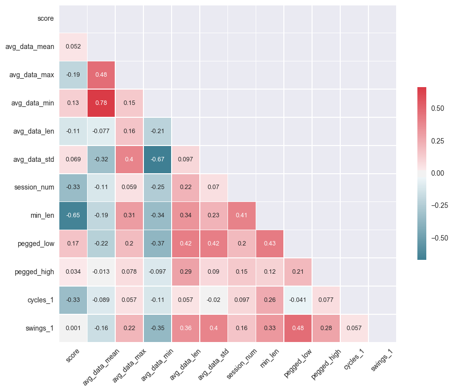

# Brian McKean 
# ===========
# BioTrak Health 
https://www.biotrakhealth.com/
##  Session Management
## Identify ineffective sessions during user trials
# ===========
## Galvanize Data Science Immersion
## Capstone Project

#### First data exploration


```python
from docx import Document
from docx.shared import Inches
import pandas as pd
import numpy as np
import matplotlib.pyplot as plt
from mpl_toolkits.axes_grid.parasite_axes import SubplotHost
from mpl_toolkits.axes_grid1 import host_subplot
import mpl_toolkits.axisartist as AA
import seaborn as sns
import requests
import scipy.stats as stats
from sklearn.ensemble import RandomForestClassifier
from sklearn.model_selection import train_test_split
from sklearn.metrics import precision_recall_curve
from sklearn.externals import joblib
from sklearn.model_selection import cross_val_score
from sklearn.model_selection import cross_val_score
from sklearn.metrics import precision_recall_curve
from sklearn.ensemble import AdaBoostClassifier
from sklearn.ensemble import GradientBoostingClassifier


```

## Get Data from files


```python
# Read in data
df_users = pd.read_json('users_02_26_2017.txt')
df_sessions = pd.read_json('sessions_02_26_2017.txt')
print df_users.columns
print df_sessions.columns
```

    Index([u'YOB', u'_id', u'email', u'first_name', u'gender', u'last_name',
           u'userid'],
          dtype='object')
    Index([u'Build#', u'Device_info_id', u'End_GMT_time', u'End_local_time',
           u'GMT_Date', u'GMT_date', u'Local_date', u'Session_data_header',
           u'Session_name', u'Session_name:', u'Session_time_interval',
           u'Session_type', u'Start_GMT_time', u'Start_local_time',
           u'Start_time_zone', u'User_info_id', u'Version#', u'_id',
           u'session_data', u'user_info_id', u'userid'],
          dtype='object')


### Initial Data Exploration


```python
print len(df_users), " users are set up"
print len(df_sessions), "sessions are uploaded"
```

    66  users are set up
    356 sessions are uploaded


```python
# Read Ratings File
df_ratings = pd.read_csv('data/ratings.csv')
print "Number of ratings is ",len(df_ratings)

```

    Number of ratings is  356


```python
print "Rated Bad:", df_ratings[df_ratings['rating']=='Bad'].count()
```

    Rated Bad: Unnamed: 0     237
    session_num    237
    rating         237
    dtype: int64


```python
print "Rated Good:",df_ratings[df_ratings['rating']=='Good'].count()
```

    Rated Good: Unnamed: 0     119
    session_num    119
    rating         119
    dtype: int64


```python
df_sessions = df_sessions.ix[:356,:]
```

#### Set up scoring

After a review session the project firmware engineer and I graded 356 sessions.  There were 237 bad and 119 good ratings. a

In addition to coming up with the ratings we jointly decided on some heuristics for determing a good and bad sessions

1. If the session was less than 60 seconds the session is bad. It is possible that a user may have an properly operating device over the 60 seconds, but we consider that not an effective use as there is not enough time to use the sessions as designed.  

2. If the session, after 60 seconds, goes to 0 (Min) or 4095 (Max), the session is bad.  Some of the sessions in this category show a significant amount of good data, but the fact that the user had problems idnicate someting that needs to be addressed.  
  * These two extremes indicate that an electrode has lost contact with the skin. Once a session has started the electrodes should continue to make proper contact until the end of the session.  
   
3. Low signal values are not a problem.  

4. Signal may be smooth with gradual peaks or there may be sharp peaks. The peaks come from activities such as jaw clenching that may be part of a session or may simply be the user exploring the operation of the device. 


#### Add New Features

In order to incororate the heuristics I add the following features

1. min_len (T/F) -- is the length at least 3600 units (60 seconds)
2. pegged_L (T/F) -- at least one value of 0 after 60 seconds
3. pegged_H (T/F) -- at least one value of 4095 afte 60 seconds


```python
# add ratings to session data
df_sessions['rating'] = df_ratings['rating']
```


```python
print df_sessions.columns

```

    Index([               u'Build#',        u'Device_info_id',
                    u'End_GMT_time',        u'End_local_time',
                        u'GMT_Date',              u'GMT_date',
                      u'Local_date',   u'Session_data_header',
                    u'Session_name',         u'Session_name:',
           u'Session_time_interval',          u'Session_type',
                  u'Start_GMT_time',      u'Start_local_time',
                 u'Start_time_zone',          u'User_info_id',
                        u'Version#',                   u'_id',
                    u'session_data',          u'user_info_id',
                          u'userid',                u'rating'],
          dtype='object')


A litte data exploration


```python
df_sessions.Session_name.unique()
```


    array([u'Open', u'Breathing for Relief', u'Head and Neck Relax',
           u'3 Minute Relax', u'Deep Breathing', u'Forest Visualization',
           u'Deep Relax for Sleep', u'Elevator Excercise',
           u'Beach Visualization', u'Cloud Visualization',
           u'Extended Exercise', u'Breath and Relax', u'Progress Muscle Relax'], dtype=object)


```python
df_sessions.Session_type.unique()
```


    array([u'open', u'managed'], dtype=object)


```python
df_groups = df_sessions.groupby('Session_name') 
```


```python
df_groups['Device_info_id'].count()
```


    Session_name
    3 Minute Relax            32
    Beach Visualization        9
    Breath and Relax           4
    Breathing for Relief      10
    Cloud Visualization        6
    Deep Breathing             6
    Deep Relax for Sleep       6
    Elevator Excercise         7
    Extended Exercise          1
    Forest Visualization       6
    Head and Neck Relax       10
    Open                     257
    Progress Muscle Relax      2
    Name: Device_info_id, dtype: int64


```python
df_results = df_sessions[['Session_name','userid']]
```


```python
# Score is True if session is bad
# we are looking for bad sessions
df_results['score'] = np.where(df_sessions['rating']=='Good', False, True)
```

    /Users/brianmckean/anaconda2/lib/python2.7/site-packages/ipykernel/__main__.py:3: SettingWithCopyWarning: 
    A value is trying to be set on a copy of a slice from a DataFrame.
    Try using .loc[row_indexer,col_indexer] = value instead
    
    See the caveats in the documentation: http://pandas.pydata.org/pandas-docs/stable/indexing.html#indexing-view-versus-copy
      app.launch_new_instance()


We have to change format for the time series data. It starts as a string of comma delimted values. The last value is uploaded incorrectly in some sessions so we discard it.


```python
# Pull session data dictionary info into it's own clumns
dfNew = df_sessions.join(pd.DataFrame(df_sessions["session_data"].to_dict()).T)
```


```python
dfNew.columns
```


    Index([               u'Build#',        u'Device_info_id',
                    u'End_GMT_time',        u'End_local_time',
                        u'GMT_Date',              u'GMT_date',
                      u'Local_date',   u'Session_data_header',
                    u'Session_name',         u'Session_name:',
           u'Session_time_interval',          u'Session_type',
                  u'Start_GMT_time',      u'Start_local_time',
                 u'Start_time_zone',          u'User_info_id',
                        u'Version#',                   u'_id',
                    u'session_data',          u'user_info_id',
                          u'userid',                u'rating',
                    u'average_data',    u'average_data_count',
                   u'baseline_data',         u'data_interval',
                      u'final_data',          u'graphed_data',
              u'graphed_data_count',              u'raw_data',
                  u'raw_data_count'],
          dtype='object')


```python
# Start calculation of features
# Convert session data from string to array of ints
# -- Drop the last entry as there was a bug that put in a bad last entry
temp = dfNew['average_data'].str.replace(" ","").str.split(',').str[:-1].map(lambda xx: np.array([int(yy) for yy in xx]))
```


```python
# Some of the time series are empty, if so insert an entry of one sample at 0
# Signal is inverted -- need to change it 
temp = temp.map(lambda x: np.array( [0] if not len(x) else x ))
temp = temp.map(lambda x: 4095 - x)
```


```python
# Get the mean
temp2 = temp.map(lambda x: x.mean())
```


```python
temp2.fillna(0,inplace=True)
df_results['avg_data_mean'] = temp2
```

    /Users/brianmckean/anaconda2/lib/python2.7/site-packages/ipykernel/__main__.py:2: SettingWithCopyWarning: 
    A value is trying to be set on a copy of a slice from a DataFrame.
    Try using .loc[row_indexer,col_indexer] = value instead
    
    See the caveats in the documentation: http://pandas.pydata.org/pandas-docs/stable/indexing.html#indexing-view-versus-copy
      from ipykernel import kernelapp as app


```python
# Get the max
t_max = temp.map(lambda x: x.max())
```


```python
df_results['avg_data_max'] = t_max
```

    /Users/brianmckean/anaconda2/lib/python2.7/site-packages/ipykernel/__main__.py:1: SettingWithCopyWarning: 
    A value is trying to be set on a copy of a slice from a DataFrame.
    Try using .loc[row_indexer,col_indexer] = value instead
    
    See the caveats in the documentation: http://pandas.pydata.org/pandas-docs/stable/indexing.html#indexing-view-versus-copy
      if __name__ == '__main__':


```python
# Get the min
df_results['avg_data_min'] = temp.map(lambda x: x.min())
```

    /Users/brianmckean/anaconda2/lib/python2.7/site-packages/ipykernel/__main__.py:2: SettingWithCopyWarning: 
    A value is trying to be set on a copy of a slice from a DataFrame.
    Try using .loc[row_indexer,col_indexer] = value instead
    
    See the caveats in the documentation: http://pandas.pydata.org/pandas-docs/stable/indexing.html#indexing-view-versus-copy
      from ipykernel import kernelapp as app


```python
# Get the length
df_results['avg_data_len'] = temp.map(lambda x: len(x))
```

    /Users/brianmckean/anaconda2/lib/python2.7/site-packages/ipykernel/__main__.py:2: SettingWithCopyWarning: 
    A value is trying to be set on a copy of a slice from a DataFrame.
    Try using .loc[row_indexer,col_indexer] = value instead
    
    See the caveats in the documentation: http://pandas.pydata.org/pandas-docs/stable/indexing.html#indexing-view-versus-copy
      from ipykernel import kernelapp as app


```python
# Get the standard deviation
df_results['avg_data_std'] = temp.map(lambda x: x.std())
```

    /Users/brianmckean/anaconda2/lib/python2.7/site-packages/ipykernel/__main__.py:2: SettingWithCopyWarning: 
    A value is trying to be set on a copy of a slice from a DataFrame.
    Try using .loc[row_indexer,col_indexer] = value instead
    
    See the caveats in the documentation: http://pandas.pydata.org/pandas-docs/stable/indexing.html#indexing-view-versus-copy
      from ipykernel import kernelapp as app


```python
df_results.columns
```


    Index([ u'Session_name',        u'userid',         u'score', u'avg_data_mean',
            u'avg_data_max',  u'avg_data_min',  u'avg_data_len',  u'avg_data_std'],
          dtype='object')


```python
# Load in session num 
df_results['session_num'] = df_results.index
```

    /Users/brianmckean/anaconda2/lib/python2.7/site-packages/ipykernel/__main__.py:2: SettingWithCopyWarning: 
    A value is trying to be set on a copy of a slice from a DataFrame.
    Try using .loc[row_indexer,col_indexer] = value instead
    
    See the caveats in the documentation: http://pandas.pydata.org/pandas-docs/stable/indexing.html#indexing-view-versus-copy
      from ipykernel import kernelapp as app


```python
# Add heuristics
df_results['min_len'] = df_results['avg_data_len']>3600
df_results['pegged_low'] = [False if (len(x)<3600 or min(x[3600:])>0) else True for x in temp]
df_results['pegged_high'] = [False if (len(x)<3600 or max(x[3600:])<4095) else True for x in temp]
```

    /Users/brianmckean/anaconda2/lib/python2.7/site-packages/ipykernel/__main__.py:2: SettingWithCopyWarning: 
    A value is trying to be set on a copy of a slice from a DataFrame.
    Try using .loc[row_indexer,col_indexer] = value instead
    
    See the caveats in the documentation: http://pandas.pydata.org/pandas-docs/stable/indexing.html#indexing-view-versus-copy
      from ipykernel import kernelapp as app
    /Users/brianmckean/anaconda2/lib/python2.7/site-packages/ipykernel/__main__.py:3: SettingWithCopyWarning: 
    A value is trying to be set on a copy of a slice from a DataFrame.
    Try using .loc[row_indexer,col_indexer] = value instead
    
    See the caveats in the documentation: http://pandas.pydata.org/pandas-docs/stable/indexing.html#indexing-view-versus-copy
      app.launch_new_instance()
    /Users/brianmckean/anaconda2/lib/python2.7/site-packages/ipykernel/__main__.py:4: SettingWithCopyWarning: 
    A value is trying to be set on a copy of a slice from a DataFrame.
    Try using .loc[row_indexer,col_indexer] = value instead
    
    See the caveats in the documentation: http://pandas.pydata.org/pandas-docs/stable/indexing.html#indexing-view-versus-copy


```python
df_results.columns
```


    Index([ u'Session_name',        u'userid',         u'score', u'avg_data_mean',
            u'avg_data_max',  u'avg_data_min',  u'avg_data_len',  u'avg_data_std',
             u'session_num',       u'min_len',    u'pegged_low',   u'pegged_high'],
          dtype='object')


```python
df_key_columns = [x  for x in list(df_results.columns) if x not  in ['Session_name','userid','score']]
print df_key_columns
```

    ['avg_data_mean', 'avg_data_max', 'avg_data_min', 'avg_data_len', 'avg_data_std', 'session_num', 'min_len', 'pegged_low', 'pegged_high']


```python
df_res_save = df_results.copy()
```


```python
y = df_results['score'].as_matrix()
X_df = df_results[df_key_columns]
X = X_df.as_matrix()
```


```python
X_train, X_test, y_train, y_test = train_test_split(
    X, y, test_size=0.33, random_state=42)
```


```python
df_results.describe()
```


<div>
<table border="1" class="dataframe">
  <thead>
    <tr style="text-align: right;">
      <th></th>
      <th>avg_data_mean</th>
      <th>avg_data_max</th>
      <th>avg_data_min</th>
      <th>avg_data_len</th>
      <th>avg_data_std</th>
      <th>session_num</th>
    </tr>
  </thead>
  <tbody>
    <tr>
      <th>count</th>
      <td>356.000000</td>
      <td>356.000000</td>
      <td>356.000000</td>
      <td>356.000000</td>
      <td>356.000000</td>
      <td>356.000000</td>
    </tr>
    <tr>
      <th>mean</th>
      <td>2080.052353</td>
      <td>3521.893258</td>
      <td>1021.233146</td>
      <td>13404.457865</td>
      <td>602.631308</td>
      <td>177.500000</td>
    </tr>
    <tr>
      <th>std</th>
      <td>997.930074</td>
      <td>883.259504</td>
      <td>1220.579913</td>
      <td>34697.181848</td>
      <td>424.079052</td>
      <td>102.912584</td>
    </tr>
    <tr>
      <th>min</th>
      <td>0.000000</td>
      <td>0.000000</td>
      <td>0.000000</td>
      <td>1.000000</td>
      <td>0.000000</td>
      <td>0.000000</td>
    </tr>
    <tr>
      <th>25%</th>
      <td>1317.220337</td>
      <td>3357.250000</td>
      <td>0.000000</td>
      <td>1152.000000</td>
      <td>264.431434</td>
      <td>88.750000</td>
    </tr>
    <tr>
      <th>50%</th>
      <td>2090.857233</td>
      <td>3901.000000</td>
      <td>423.000000</td>
      <td>3736.000000</td>
      <td>508.647631</td>
      <td>177.500000</td>
    </tr>
    <tr>
      <th>75%</th>
      <td>2837.760875</td>
      <td>4047.000000</td>
      <td>1945.250000</td>
      <td>13222.000000</td>
      <td>939.515026</td>
      <td>266.250000</td>
    </tr>
    <tr>
      <th>max</th>
      <td>4095.000000</td>
      <td>4095.000000</td>
      <td>4095.000000</td>
      <td>382019.000000</td>
      <td>1667.963040</td>
      <td>355.000000</td>
    </tr>
  </tbody>
</table>
</div>


```python
clf = RandomForestClassifier(n_estimators=10, random_state=42).fit(X_train,y_train)

```


```python

scores = cross_val_score(clf, X_train, y_train, cv=10)
```


```python
print scores
print scores.mean()
```

    [ 0.83333333  0.79166667  0.95833333  0.91666667  0.79166667  0.875
      0.95833333  0.875       0.82608696  0.82608696]
    0.865217391304


```python
pred = clf.predict(X_train)
```


```python
print clf.feature_importances_

for i in range(len(clf.feature_importances_)):
    print X_df.columns[i], clf.feature_importances_[i]
    
clf_save = clf
clf_name_save = X_df.columns
X_save = X_df.as_matrix()
```

    [ 0.07482741  0.05206467  0.09356981  0.28436927  0.10351105  0.08949767
      0.15199783  0.14889914  0.00126317]
    avg_data_mean 0.074827409527
    avg_data_max 0.0520646674285
    avg_data_min 0.0935698076556
    avg_data_len 0.284369266812
    avg_data_std 0.10351104636
    session_num 0.0894976678294
    min_len 0.151997825363
    pegged_low 0.148899139956
    pegged_high 0.00126316906828


```python
pred_test = clf.predict(X_test)
```


```python
clf.score(X_test,y_test)
```


    0.92372881355932202


```python
clf.get_params

```


    <bound method RandomForestClassifier.get_params of RandomForestClassifier(bootstrap=True, class_weight=None, criterion='gini',
                max_depth=None, max_features='auto', max_leaf_nodes=None,
                min_impurity_split=1e-07, min_samples_leaf=1,
                min_samples_split=2, min_weight_fraction_leaf=0.0,
                n_estimators=10, n_jobs=1, oob_score=False, random_state=42,
                verbose=0, warm_start=False)>


```python
y_prob = clf.predict_proba(X_test)[:,1:]
```


```python
missed = np.where([pred_test != y_test])[1]
```


```python
for idx in missed:
    print df_results.iloc[idx]['session_num']
```

    10
    20
    29
    56
    64
    67
    71
    88
    115


```python
for i in range(len(missed)):
    print i, clf.predict_proba(X_test)[i]
```

    0 [ 0.  1.]
    1 [ 0.  1.]
    2 [ 0.7  0.3]
    3 [ 0.  1.]
    4 [ 0.  1.]
    5 [ 0.2  0.8]
    6 [ 0.  1.]
    7 [ 0.  1.]
    8 [ 0.8  0.2]


```python

```


```python
precision, recall, thresholds = precision_recall_curve(y_test, y_prob)
```


```python
print precision, recall, thresholds
```

    [ 0.75238095  0.84615385  0.90588235  0.94805195  0.97260274  1.          1.
      1.          1.          1.          1.        ] [ 1.          0.97468354  0.97468354  0.92405063  0.89873418  0.88607595
      0.87341772  0.83544304  0.82278481  0.65822785  0.        ] [ 0.1  0.2  0.3  0.4  0.5  0.6  0.7  0.8  0.9  1. ]


```python
df = pd.DataFrame()
```


```python
df['precision'] = precision
```


```python
print len(precision), len(recall), len(thresholds)
thresholds = np.append(thresholds,1.0)
print len(precision), len(recall), len(thresholds)
```

    11 11 10
    11 11 11


```python
df['recall'] = recall
df['thresholds'] = thresholds
```


```python
%matplotlib inline
df.plot()
```


    <matplotlib.axes._subplots.AxesSubplot at 0x12e8d0750>


```python
byScore = df_results.groupby('score').count()
```


```python
print byScore['avg_data_min']
```

    score
    False    119
    True     237
    Name: avg_data_min, dtype: int64


```python

## Add in the cycles and largest swing features

def count_crosses(s, pts=10, intv=600):
    '''
    Looks at series
    for each 'intv' points
    - count crossings of 'pts' lookback moving average
    INPUTS:
        s = list of measurements
        pts = how many pts to collect for moving average
        intv = interval to measure crossing (600 = 10 sec)
    OUTPUTS
        crossings / intv = average crossing per interval
        biggest_move = on a crossing biggest move

    '''
    if len(s) < intv:
        return 0, 0
    if pts >= intv:
        return 0,0
    s = np.array(s)
    crossing_counts = [0]  
    index = pts
    max_swing = 0
    up = True # True for last cross up, False for down
    while (index + intv < len(s)):
        #print index
        interval_crossings = 0
        for i in range(intv):
            last_n = s[index-pts:index]
            avg = last_n.mean()
            if up and s[index] < avg:
                up = False
                interval_crossings += 1
                swing = abs(s[index]-s[index-1])
                if swing > max_swing:
                    max_swing = swing
            if not up and s[index] > avg:
                up = True
                interval_crossings += 1
                swing = abs(s[index]-s[index-1])
                if swing > max_swing:
                    max_swing = swing
            index += 1
        crossing_counts.append(interval_crossings)
   
    time_sec = intv/60.0
    return np.array(crossing_counts).mean()/(2*time_sec), max_swing
            
            
            
```


```python
df_results3 = df_res_save.copy()
cycles = []
swings = []

look_back = [1]
#look_back = [3]

for look in look_back:
    c = []
    s = []
    for idx, elem in enumerate(temp):
        a,b = count_crosses(elem, pts=look)
        c.append(a)
        s.append(b)
    cycles.append(c)
    swings.append(s)
    df_results3['cycles_{0}'.format(look)] = c
    df_results3['swings_{0}'.format(look)] = s
    
    #plt.hist(cycles)
    #plt.hist(swings)
        
```


```python
#df_results3
```


```python
df4 = df_results.copy()
df4['cycles_1'] = df_results3['cycles_1']
df4['swings_1'] = df_results3['swings_1']
```


```python

```


```python
sns_plot = sns.pairplot(df4)
sns_plot.savefig("sns-pairplot.png")
```


```python
y2 = df4['score'].as_matrix()
X_df2 = df4[['avg_data_mean',
        'avg_data_max',  'avg_data_min',  'avg_data_std', 'avg_data_len',
            'cycles_1','swings_1','min_len','pegged_low','pegged_high']]
X2 = X_df2.as_matrix()
```


```python
X_train, X_test, y_train, y_test = train_test_split(
    X2, y2, test_size=0.33, random_state=42)
```


```python
clf = RandomForestClassifier(n_estimators=10, random_state=42).fit(X_train,y_train)
clf = clf.fit(X_train, y_train)

```


```python
clf_save = clf
clf_name_save = X_df2.columns
X_save = X_df2.as_matrix()
```


```python

scores = cross_val_score(clf, X_train, y_train, cv=10)
```


```python
print scores
print np.average(scores)
```

    [ 0.79166667  0.95833333  0.875       0.875       0.875       0.95833333
      0.91666667  0.95833333  0.82608696  0.82608696]
    0.886050724638


```python
print clf.feature_importances_

for i in range(len(clf.feature_importances_)):
    print X_df2.columns[i], clf.feature_importances_[i]
```

    [ 0.07064774  0.05054319  0.09737334  0.10564576  0.25162631  0.1348587
      0.0572746   0.13476878  0.09468364  0.00257796]
    avg_data_mean 0.070647739072
    avg_data_max 0.050543185561
    avg_data_min 0.0973733381049
    avg_data_std 0.10564575551
    avg_data_len 0.251626310731
    cycles_1 0.134858702122
    swings_1 0.0572745976741
    min_len 0.134768777261
    pegged_low 0.094683635819
    pegged_high 0.00257795814473


```python

```


```python
precision, recall, thresholds = precision_recall_curve(y_test, y_prob)
print precision, recall, thresholds
```

    [ 0.75238095  0.84615385  0.90588235  0.94805195  0.97260274  1.          1.
      1.          1.          1.          1.        ] [ 1.          0.97468354  0.97468354  0.92405063  0.89873418  0.88607595
      0.87341772  0.83544304  0.82278481  0.65822785  0.        ] [ 0.1  0.2  0.3  0.4  0.5  0.6  0.7  0.8  0.9  1. ]


```python
fig = plt.figure()
ax = fig.add_subplot(1,1,1)
ax.set_ylabel('Precision and Recall',fontsize=16)
x1 = np.arange(0,10)/5.0
#ax.plot(x1,df['precision'])
labels = [item.get_text() for item in ax.get_xticklabels()]
labels[1] = 'Testing'
ax.plot(df['precision'])
ax.plot(df['recall'])
#ax.plot(df['thresholds'])
ax.set_xlim(0,10)
#labels = 
ax.set_xticklabels(x1)
ax.set_title('Precision and Recall Versus Probability Threshold',fontsize=20,y=1.08)
ax.set_xlabel('Probability Threshold',fontsize=18)
#plt.ylabel('Density',fontsize=18)
#plt.title('Average Frequency in Tension Measurement', fontsize=24)
ax.tick_params(axis='both',labelsize=12)
plt.legend(fontsize=20,loc=0)
plt.show()
plt.savefig('prec-recall.png',bbox_inches='tight')
```


    <matplotlib.figure.Figure at 0x13eeea550>


```python
df4_t = df4[df4['score']==True]
```


```python
df4_f = df4[df4['score']==False]
```


```python
# Set up the matplotlib figure

sns.distplot( df4_t['cycles_1'], label = 'Bad')
sns.distplot( df4_f['cycles_1'], label = 'Good')
plt.xlabel('Hz',fontsize=18)
plt.ylabel('Density',fontsize=18)
plt.title('Average Frequency in Tension Measurement', fontsize=24, y=1.10)
plt.tick_params(axis='both',labelsize=16)
plt.legend(fontsize=20)
plt.savefig('feat-freq.png',bbox_inches='tight')
```


```python
sns.distplot( df4_t['avg_data_mean'],label = 'True')
sns.distplot( df4_f['avg_data_mean'], label = 'False')
plt.legend()
```


    <matplotlib.legend.Legend at 0x129991150>


```python
sns.distplot( df4_t['avg_data_len']/60.0,label = 'Bad')
sns.distplot( df4_f['avg_data_len']/60.0, label = 'Good')
plt.xlabel('Seconds',fontsize=18)
plt.ylabel('Density',fontsize=18)
plt.title('Length of Session', fontsize=24, y=1.08)
plt.tick_params(axis='both',labelsize=16)
plt.legend(fontsize=20)
plt.savefig('feat-session-length.png',bbox_inches='tight')
```


```python
sns.distplot( df4_t['avg_data_max'],label = 'Bad')
sns.distplot( df4_f['avg_data_max'], label = 'Good')
plt.legend(loc=0)
```


    <matplotlib.legend.Legend at 0x12067d210>


```python
sns.distplot( df4_t['avg_data_min'],label = 'Bad')
sns.distplot( df4_f['avg_data_min'], label = 'Good')
plt.legend()
```


    <matplotlib.legend.Legend at 0x129860f50>


```python
sns.distplot( df4_t['avg_data_std']/4095.0,label = 'Bad')
sns.distplot( df4_f['avg_data_std']/4095.0, label = 'Good')
plt.xlabel('Std in 0-10 Tension Scale',fontsize=18)
plt.ylabel('Density',fontsize=18)
plt.title('Standard Deviation in Tension Measurement', fontsize=24,y=1.08)
plt.tick_params(axis='both',labelsize=12)
plt.legend(fontsize=20)
plt.savefig('feat-std.png',bbox_inches='tight')
```


```python

good = [len(np.where(df4_f['avg_data_std']<=60)[0]),
            len(np.where(df4_f['avg_data_std']>60)[0]) ]


bad = [len(np.where(df4_t['avg_data_std']<=60)[0]),
            len(np.where(df4_t['avg_data_std']>60)[0]) ]
```


```python
fig, ax = plt.subplots()

index = np.arange(2)
bar_width = 0.35

opacity = 0.4
error_config = {'ecolor': '0.3'}


rects1 = plt.bar(index, 
                 bad, 
                 bar_width,
                 alpha=opacity,
                 color='b',
                 label='Bad')

rects2 = plt.bar(index + bar_width,
                 good,  
                 bar_width,
                 alpha=opacity,
                 color='g',
                 label='Good')

plt.xlabel('Session Length',fontsize=18)
plt.ylabel('Number of Sessions',fontsize=18)
plt.title('60 Second Minimum Length',fontsize=22)
plt.xticks(index + bar_width , ('Less than 60 seconds', 'At least 60 seconds'))
plt.legend(fontsize=16, loc=0)
plt.tick_params(axis='both',labelsize=16)
plt.tight_layout()
plt.show()
plt.savefig('feat-60-sec_min.png',bbox_inches='tight')
```


    <matplotlib.figure.Figure at 0x1466f2e10>


```python
sns.distplot( df4_t['pegged_low'],kde=False, label = 'Bad')
sns.distplot( df4_f['pegged_low'],kde=False, label = 'Good')

plt.legend()
```


    <matplotlib.legend.Legend at 0x12a9d6990>


```python
sns.distplot( df4_t['pegged_high'],kde=False, label = 'Bad')
sns.distplot( df4_f['pegged_high'], kde=False, label = 'Good')
plt.legend()
```


    <matplotlib.legend.Legend at 0x12ad30f90>


```python
# Set up the matplotlib figure
df4.columns

```


    Index([ u'Session_name',        u'userid',         u'score', u'avg_data_mean',
            u'avg_data_max',  u'avg_data_min',  u'avg_data_len',  u'avg_data_std',
             u'session_num',       u'min_len',    u'pegged_low',   u'pegged_high',
                u'cycles_1',      u'swings_1'],
          dtype='object')


```python
clf = RandomForestClassifier(n_estimators=10, random_state=42).fit(X_train,y_train)

scores = cross_val_score(clf, X_train, y_train, cv=10)
print scores
print np.average(scores)
```

    [ 0.79166667  0.95833333  0.875       0.875       0.875       0.95833333
      0.91666667  0.95833333  0.82608696  0.82608696]
    0.886050724638


```python

joblib.dump(clf, 'brtakrf_class.pkl') 
```


    ['brtakrf_class.pkl']


```python

```


```python
clfab = AdaBoostClassifier(base_estimator=None, 
 n_estimators=50, learning_rate=1.0, algorithm='SAMME.R', 
                           random_state=42).fit(X_train,y_train)
```


```python
scores_ab = cross_val_score(clfab, X_train, y_train, cv=10)
print scores_ab
print np.average(scores_ab)

```

    [ 0.79166667  0.91666667  0.95833333  0.875       0.875       0.875       0.875
      0.875       0.7826087   0.7826087 ]
    0.860688405797


```python
clfgb = GradientBoostingClassifier(loss='deviance', learning_rate=0.1, 
                    n_estimators=100, subsample=1.0, 
                    criterion='friedman_mse', min_samples_split=2, 
                    min_samples_leaf=1, min_weight_fraction_leaf=0.0, 
                    max_depth=3, min_impurity_split=1e-07, init=None, 
                    random_state=42, max_features=None, 
                    verbose=0, max_leaf_nodes=None, 
                    warm_start=False, presort='auto').fit(X_train,y_train)
```


```python
scores_gb = cross_val_score(clfgb, X_train, y_train, cv=10)
print scores_gb
print np.average(scores_gb)
```

    [ 0.875       0.91666667  0.91666667  0.875       0.91666667  0.91666667
      0.83333333  0.91666667  0.86956522  0.91304348]
    0.894927536232


```python
scores_rf = cross_val_score(clf, X_train, y_train, cv=10)
print scores_rf
```

    [ 0.79166667  0.95833333  0.875       0.875       0.875       0.95833333
      0.91666667  0.95833333  0.82608696  0.82608696]


```python
RF_pred = clf.predict(X2)
```


```python
df4['RF_pred'] = RF_pred
```


```python
y2 = df4['score'].as_matrix()
X_df2 = df4[['avg_data_mean',
        'avg_data_max',  'avg_data_min',  'avg_data_std', 'avg_data_len',
            'cycles_1','swings_1','min_len','pegged_low','pegged_high','RF_pred']]
X2 = X_df2.as_matrix()
```


```python
X_train, X_test, y_train, y_test = train_test_split(
    X2, y2, test_size=0.33, random_state=42)
```


```python
clfab = AdaBoostClassifier(base_estimator=None, n_estimators=50, 
            learning_rate=1.0, algorithm='SAMME.R', random_state=42).fit(X_train,y_train)

scores_ab = cross_val_score(clfab, X_train, y_train, cv=10)
print scores_ab
print np.average(scores_ab)
```

    [ 1.          1.          1.          0.95833333  1.          1.
      0.95833333  1.          1.          0.95652174]
    0.98731884058


```python
scores_ab = cross_val_score(clfab, X_test, y_test, cv=10)
print scores_ab
print np.average(scores_ab)
```

    [ 0.91666667  0.83333333  1.          0.91666667  1.          0.91666667
      0.91666667  0.91666667  1.          0.9       ]
    0.931666666667


```python
clfgb = GradientBoostingClassifier(loss='deviance', 
            learning_rate=0.1, n_estimators=100, subsample=1.0, 
            criterion='friedman_mse', min_samples_split=2,
            min_samples_leaf=1, min_weight_fraction_leaf=0.0, 
            max_depth=3, min_impurity_split=1e-07, init=None, 
            random_state=42, max_features=None, verbose=0, 
            max_leaf_nodes=None, warm_start=False, presort='auto').fit(X_train,y_train)
scores_gb = cross_val_score(clfgb, X_train, y_train, cv=10)
print scores_gb
print np.average(scores_gb)
```

    [ 1.          1.          1.          0.95833333  1.          1.          1.
      1.          1.          0.95652174]
    0.991485507246


```python
scores_gb = cross_val_score(clfgb, X_test, y_test, cv=10)
print scores_gb
print np.average(scores_gb)
```

    [ 0.83333333  0.83333333  0.91666667  1.          1.          0.91666667
      0.91666667  1.          1.          0.9       ]
    0.931666666667


```python
joblib.dump(clf, 'brtakgb_class.pkl') 
```


    ['brtakgb_class.pkl']


```python
trial_users = pd.read_csv('TrialUsers.csv', header=None)
```


```python
df_trial = df4[df_results['userid'].isin(trial_users[0]) |df_results['userid'].str.contains('pilot') ]
```


```python
y_trial = df_trial['score'].as_matrix()
X_trial_df = df_trial[['avg_data_mean',
        'avg_data_max',  'avg_data_min',  'avg_data_std', 'avg_data_len', 
            'cycles_1','swings_1','min_len','pegged_low','pegged_high']]
```


```python
X_trial = X_trial_df.as_matrix()
```


```python
trial_score = clf.score(X_trial, y_trial)
print trial_score
```

    0.96875


```python
X_trial_df2= X_trial_df.copy()
X_trial_df2['RF_pred'] = clf.predict(X_trial)
X_trial2 = X_trial_df2.as_matrix()
X_train, X_test, y_train, y_test = train_test_split(
    X_trial2, y_trial, test_size=0.33, random_state=42)

```


```python
trial_score_gb = clfgb.score(X_trial2, y_trial)
print trial_score_gb
```

    0.96875


```python
trial_score_ab = clfab.score(X_trial2, y_trial)
print trial_score_ab
```

    0.96875


```python
clfab.feature_importances_
```


    array([ 0.04,  0.14,  0.06,  0.22,  0.08,  0.  ,  0.1 ,  0.  ,  0.  ,
            0.  ,  0.36])


```python
len(X_trial[0])
```


    10


```python
print df_trial.columns
len(df_trial.columns)
```

    Index([ u'Session_name',        u'userid',         u'score', u'avg_data_mean',
            u'avg_data_max',  u'avg_data_min',  u'avg_data_len',  u'avg_data_std',
             u'session_num',       u'min_len',    u'pegged_low',   u'pegged_high',
                u'cycles_1',      u'swings_1',       u'RF_pred'],
          dtype='object')


    15


```python
print X_df.columns
print X_df2.columns
print X_trial_df.columns
print X_trial_df2.columns
```

    Index([u'avg_data_mean', u'avg_data_max', u'avg_data_min', u'avg_data_len',
           u'avg_data_std', u'session_num', u'min_len', u'pegged_low',
           u'pegged_high'],
          dtype='object')
    Index([u'avg_data_mean', u'avg_data_max', u'avg_data_min', u'avg_data_std',
           u'avg_data_len', u'cycles_1', u'swings_1', u'min_len', u'pegged_low',
           u'pegged_high', u'RF_pred'],
          dtype='object')
    Index([u'avg_data_mean', u'avg_data_max', u'avg_data_min', u'avg_data_std',
           u'avg_data_len', u'cycles_1', u'swings_1', u'min_len', u'pegged_low',
           u'pegged_high'],
          dtype='object')
    Index([u'avg_data_mean', u'avg_data_max', u'avg_data_min', u'avg_data_std',
           u'avg_data_len', u'cycles_1', u'swings_1', u'min_len', u'pegged_low',
           u'pegged_high', u'RF_pred'],
          dtype='object')


```python
print 'Bad=',len([x  for x in y_trial if x==True])
print 'Good=',len([x  for x in y_trial if x==False])
```

    Bad= 33
    Good= 31


```python
y_pred2 = clfgb.predict(X_trial2)
```


```python
print 'Bad=',len([x  for x in y_pred2 if x==True])
print 'Good=',len([x  for x in y_pred2 if x==False])
```

    Bad= 31
    Good= 33


```python
right = y_trial == y_pred2
```


```python
print 'Correct=',len([x  for x in right if x==True])
print 'Incorrect=',len([x  for x in right if x==False])
```

    Correct= 62
    Incorrect= 2


```python
y_pred2 = clf.predict(X_trial)
right = y_trial == y_pred2
print 'Correct=',len([x  for x in right if x==True])
print 'Incorrect=',len([x  for x in right if x==False])
```

    Correct= 62
    Incorrect= 2


```python
#df_trial[df_trial['score']!=df_trial['RF_pred']]
```


```python
# Compute the correlation matrix
corr = df_results.corr()

# Generate a mask for the upper triangle
mask = np.zeros_like(corr, dtype=np.bool)
mask[np.triu_indices_from(mask)] = True

# Set up the matplotlib figure
f, ax = plt.subplots(figsize=(11, 9))

# Generate a custom diverging colormap
cmap = sns.diverging_palette(220, 10, as_cmap=True)

# Draw the heatmap with the mask and correct aspect ratio
sns.heatmap(corr, mask=mask, cmap=cmap, vmax=.3,
            square=True, 
            linewidths=.5, cbar_kws={"shrink": .5}, ax=ax, annot=True, annot_kws={"size": 9})
plt.xticks(rotation=45)
plt.yticks(rotation=0)
```


    (array([ 0.5,  1.5,  2.5,  3.5,  4.5,  5.5,  6.5,  7.5,  8.5,  9.5]),
     <a list of 10 Text yticklabel objects>)


```python
# Compute the correlation matrix
corr = df4.corr()

# Generate a mask for the upper triangle
mask = np.zeros_like(corr, dtype=np.bool)
mask[np.triu_indices_from(mask)] = True

# Set up the matplotlib figure
f, ax = plt.subplots(figsize=(11, 9))

# Generate a custom diverging colormap
cmap = sns.diverging_palette(220, 10, as_cmap=True)

# Draw the heatmap with the mask and correct aspect ratio
sns.heatmap(corr, mask=mask, cmap=cmap, vmax=.3,
            square=True, 
            linewidths=.5, cbar_kws={"shrink": .5}, ax=ax, annot=True, annot_kws={"size": 9})
plt.xticks(rotation=45)
plt.yticks(rotation=0)
```


    (array([  0.5,   1.5,   2.5,   3.5,   4.5,   5.5,   6.5,   7.5,   8.5,
              9.5,  10.5,  11.5,  12.5]), <a list of 13 Text yticklabel objects>)


```python
# Compute the correlation matrix
df9=df4.drop('RF_pred',axis=1)
corr = df9.corr()

# Generate a mask for the upper triangle
mask = np.zeros_like(corr, dtype=np.bool)
mask[np.triu_indices_from(mask)] = True

# Set up the matplotlib figure
f, ax = plt.subplots(figsize=(11, 9))

# Generate a custom diverging colormap
cmap = sns.diverging_palette(220, 10, as_cmap=True)

# Draw the heatmap with the mask and correct aspect ratio
sns.heatmap(corr, mask=mask, cmap=cmap, vmax=.3,
            square=True, 
            linewidths=.5, cbar_kws={"shrink": .5}, ax=ax, annot=True, annot_kws={"size": 9})
plt.xticks(rotation=45)
plt.yticks(rotation=0)
```


    (array([  0.5,   1.5,   2.5,   3.5,   4.5,   5.5,   6.5,   7.5,   8.5,
              9.5,  10.5,  11.5]), <a list of 12 Text yticklabel objects>)





```python
forest = clf_save
names = clf_name_save
X = X_save

importances = forest.feature_importances_
print len(importances), len(forest.feature_importances_)
std = np.std([tree.feature_importances_ for tree in forest.estimators_],
             axis=0)

indices = np.argsort(importances)[::-1]

# Print the feature ranking
print("Feature ranking:")

for f in range(X.shape[1]):
    print("%d. feature %s (%f)" % (f + 1, names[indices[f]], importances[indices[f]]))

# Plot the feature importances of the forest
plt.figure()
plt.title("Feature importances")
plt.bar(range(X.shape[1]), importances[indices],
       color="r", yerr=std[indices], align="center")
plt.xticks(range(X.shape[1]), names[indices], rotation=45)
plt.xlim([-1, X.shape[1]])
plt.show()
plt.savefig('feat-imp.png',bbox_inches='tight')
```

    10 10
    Feature ranking:
    1. feature avg_data_len (0.251626)
    2. feature cycles_1 (0.134859)
    3. feature min_len (0.134769)
    4. feature avg_data_std (0.105646)
    5. feature avg_data_min (0.097373)
    6. feature pegged_low (0.094684)
    7. feature avg_data_mean (0.070648)
    8. feature swings_1 (0.057275)
    9. feature avg_data_max (0.050543)
    10. feature pegged_high (0.002578)


    <matplotlib.figure.Figure at 0x14a86b6d0>

